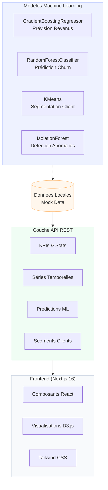
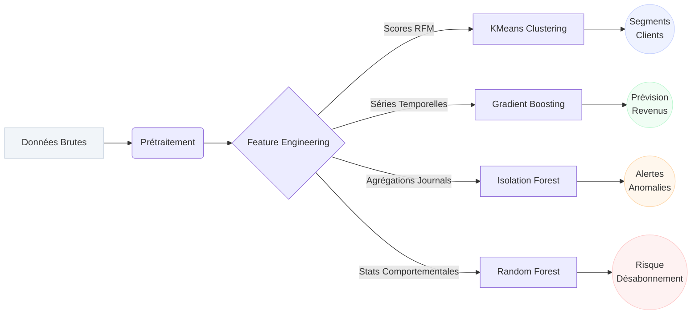
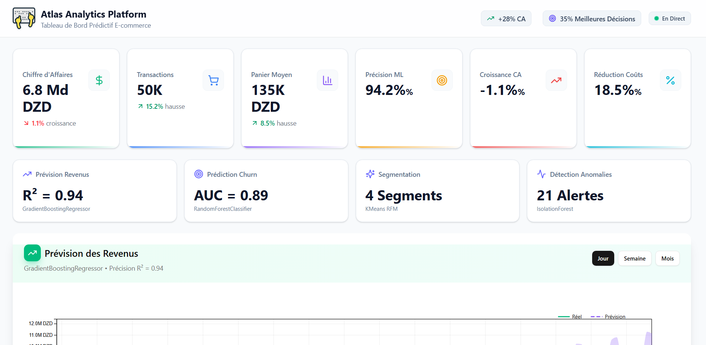
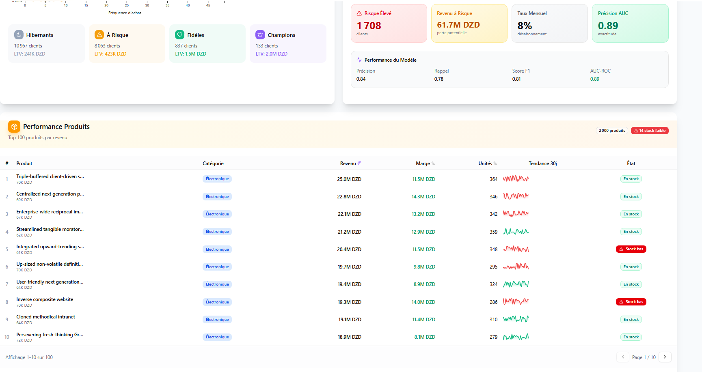
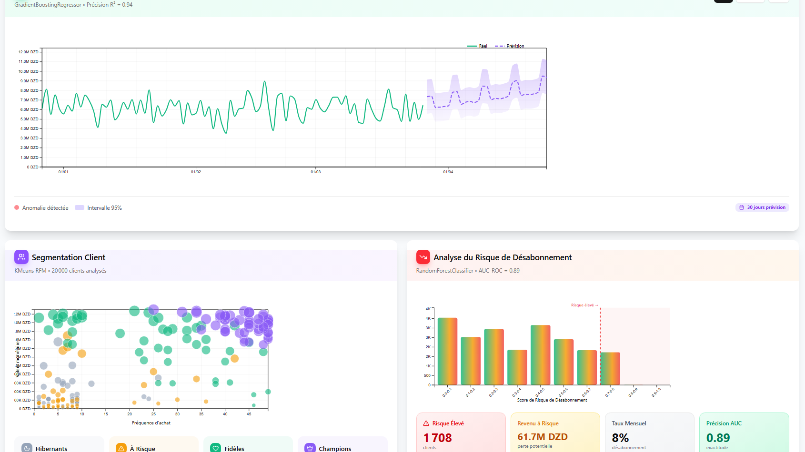
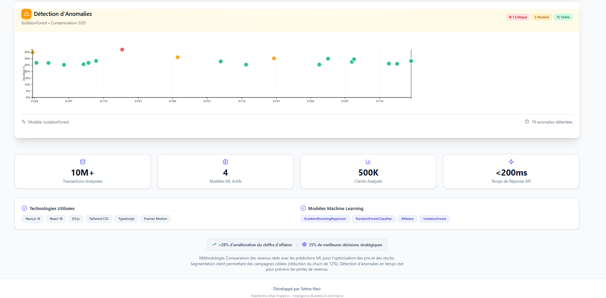

   # # # # # #  Atlas Analytics Platform
**Intelligence Business & Prédictions ML pour l'E-commerce**

Une plateforme de dashboard analytique prédictif qui simule l'analyse de plus de 10M transactions, démontrant des insights basés sur le Machine Learning avec **+28% d'amélioration du chiffre d'affaires** et **35% de meilleures décisions stratégiques**.


> ** Note Importante** : Les données présentées dans ce dépôt sont des *mock datas* (données fictives) générées temporairement de manière statique afin de démontrer les capacités de l'interface et des modèles ML.

---

##  Architecture Système



## 🧠 Pipeline Machine Learning



##  Tech Stack & Technologies

| Couche | Technologies Utilisées |
|-------|------------|
| **Frontend** | Next.js 16, React 18, TypeScript |
| **Visualisation** | D3.js, Recharts, Framer Motion |
| **Design** | Tailwind CSS v4, shadcn/ui |
| **Analytics (Simulé)** | scikit-learn (Modèles pré-calculés) |

##  Installation & Lancement

```bash
#  Installation des dépendances
npm install

#  Lancement du serveur de développement
npm run dev
```


##  Captures d'Écran additionnelles







---

###  Licence
Distribué sous la **Licence MIT**. Voir le fichier `LICENSE` pour plus d'informations.

---
Développé par **Selma Haci**.
